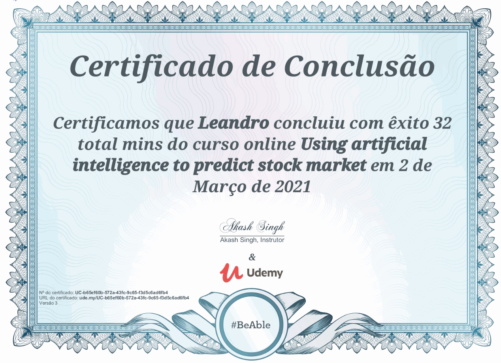

# AI_MachineLearning_stock_apple_predict
This python3 program contains the code used to develop an Artificial intelligence (Long short-term memory (LSTM)) based prediction tool to predict Apple stock price market.

The stock data used to build the model was taken from the folowing site:
- https://query1.finance.yahoo.com/v7/finance/download/AAPL?period1=1586485012&period2=1618021012&interval=1d&events=history&includeAdjustedClose=true
The download provides a CSV with a specific time used to build the trained model and the predict algorithm

The program:

This is part of the folowing course:
https://www.udemy.com/certificate/UC-b65ef60b-572a-43fc-9c65-f3d5c6ad6fb4/

